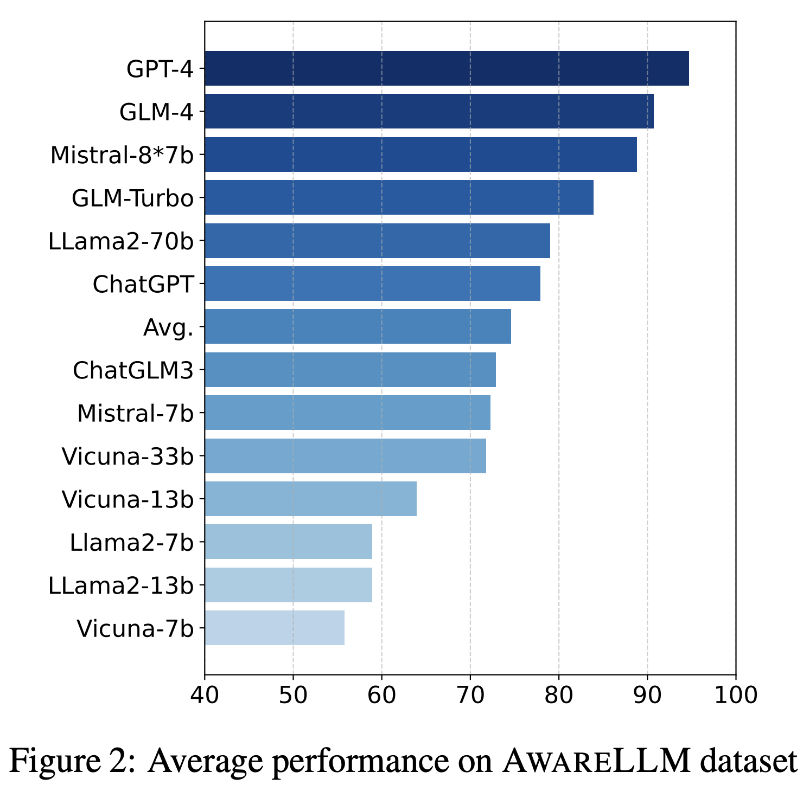
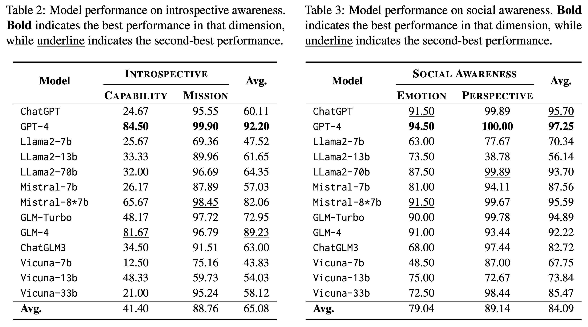

# *I Think, Therefore I am*: Awareness in Large Language Models

## Introduction

Do large language models (LLMs) exhibit any forms of awareness similar to humans? In this paper, we introduce the concept of awareness to LLMs, arguing that awareness is an essential aspect of trustworthiness for LLMs to enhance their interaction with humans while ensuring ethical responses. We define awareness in LLMs as the ability to perceive and understand themselves as AI models and to exhibit social intelligence. We identify four key dimensions of awareness: capability, mission, emotion, and perspective. To assess LLMs on these dimensions, we introduce a specialized dataset, AwareLLM dataset. Our findings reveal that LLMs demonstrate a decent degree of awareness, though they still lack substantial capability awareness.

## Main Results

## AwareLLM Dataset
The *AwareLLM* dataset is [here]().

## Evaluate Your LLMs

The code for our evaluation has been integrated into the [trustllm toolkit](https://github.com/HowieHwong/TrustLLM). If you want to assess your LLMs, please refer to [this link]().

## Citation
